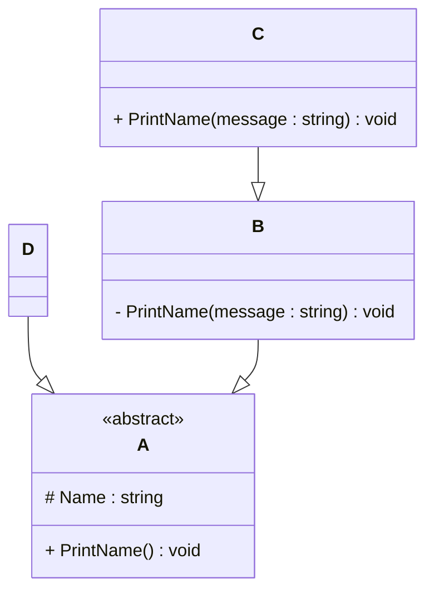

## Exercise 3

### 1. **Implementation Task**  
   Based on the class diagram below, provide an implementation in any object-oriented programming language of your choice.
   

### 2. **Key Questions**  
   - Are you able to directly create a new instance of `ObjectA`? Please explain your answer.  

   No we can't create instance of class A dirrectly. Class A is abstract so it is design to be inherited, not instantiated directly. Class a is a model for the extends classes.

   - Given an instance of `ObjectC`, are you able to call the method `PrintMessage` defined in `ObjectB`? Please explain your answer.  

   We can't call the methode PrintMessage define in ObjectB because this methode is private so only ObjectB can use this methode. It is not accessible to other Object even if objectC is an extend of ObjectB.

   - Try to explain as many key features of object-oriented programming as you can find in this example.

   Abstraction: Class A is an abstract class an is a sort of model for the extend class.
   Override: Class A has a method (printName) but this methode is not defined in class A but in the extend class. The deffinitions can differ between class B and class D.
   Heritage: Allow class to use the code from a other class. We this methode we don't have to rewrite the same line of code in different class.
   Overload: We have different methods with the same name. In class B there are 2 printName method but one has a String argument when the other takes no argument.
